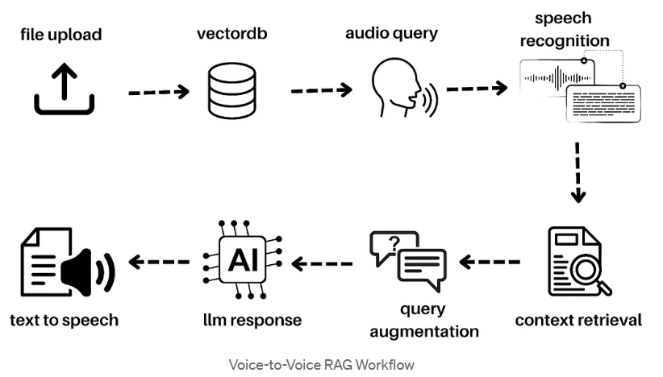

# VoiceRAG

* It's a Voice RAG project built with LiveKit agent. It uses :

🟢 Silero VAD to detect when I start speaking

🗣️ AssemblyAI to convert my speech to text

📄 ChromaDB for vector search across uploaded documents

🧠 LLM (Gemini/OpenAI) to generate intelligent responses

🗣️ Cartesia TTS to speak the reply out loud

🧬 And finally… Cartesia Voice Cloning so the reply comes in my own voice

❤️ Livekit for orchestration 

## FlowChart

